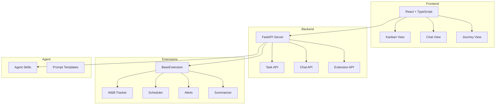

# Architecture

## Overview

Research Toolbox is a monorepo with three main layers:

## Data Flow

1. **User → Frontend**: User interacts with Kanban board or Chat
2. **Frontend → Backend**: API calls (REST, future: WebSocket for streaming)
3. **Backend → Extensions**: Extension lifecycle (setup/teardown/status)
4. **Backend → Agent**: Agent runtime for chat responses and autonomous actions
5. **Agent → Backend**: Agent creates tasks, journey entries, triggers extensions

## Key Design Decisions

| Decision | Choice | Rationale |
|----------|--------|-----------|
| Frontend Framework | Vite + React | Faster dev server, simpler config than Next.js |
| Backend Framework | FastAPI | Async-first, auto-docs, Pydantic validation |
| Extension System | Dynamic module loading | No config files, just drop a directory |
| State Management | In-memory (for now) | Speed to prototype; DB migration planned |
| Monorepo | Single repo | Simplifies CI, cross-layer changes, agent context |
